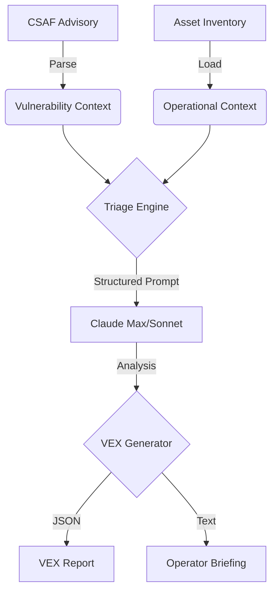

# LAT-OT Architecture & Design

## Overview
LAT-OT (LLM-powered Advisory Triage for OT-Security) is a framework designed to automate the triage of security advisories in industrial environments. It leverages Large Language Models (LLMs) to bridge the gap between structured vulnerability data (CSAF/VEX) and operational asset context.

## System Architecture

### 1. Data Ingestion Layer
*   **CSAF Parser:** Consumes machine-readable security advisories (JSON). It strips unnecessary metadata and focuses on affected products (CPEs), vulnerability descriptions, and remediation steps.
*   **Asset Loader:** Imports local asset inventories from CSV or JSON. It captures critical OT context: firmware versions, network location, internet exposure, and operational criticality.

### 2. Correlation & Triage Engine
*   **CPE Matcher:** Performs initial filtering by correlating advisory-affected products with the local asset inventory.
*   **Prompt Synthesizer:** Orchestrates the context for the LLM. It combines the extracted vulnerability data with the specific matched asset context into a high-precision prompt.
*   **LLM Analysis (Claude Max/Sonnet):** Performs the "Reasoning" step. It evaluates if a vulnerability is exploitable in the specific OT environment (e.g., "Is the web server active?", "Is the firmware version truly vulnerable?").

### 3. Reporting & Feedback Layer
*   **VEX Generator:** Transforms the LLM's natural language reasoning back into a machine-readable **VEX (Vulnerability Exploitability eXchange)** format.
*   **Operator Briefing:** Generates concise, actionable summaries for plant technicians who may not be security experts.

## Data Flow Diagram

## Anti-Hallucination Strategy
To ensure safety in critical infrastructure, LAT-OT employs:
1.  **Grounded Context:** The LLM is strictly limited to the provided advisory and asset data.
2.  **Chain-of-Thought:** The model must externalize its reasoning steps before providing a risk rating.
3.  **Source Attribution:** The system requires the LLM to cite specific fields (e.g., "CVE Description", "Asset Firmware") for every conclusion.
4.  **Structured Output:** Using JSON schemas for LLM responses to ensure deterministic integration with the VEX Generator.
